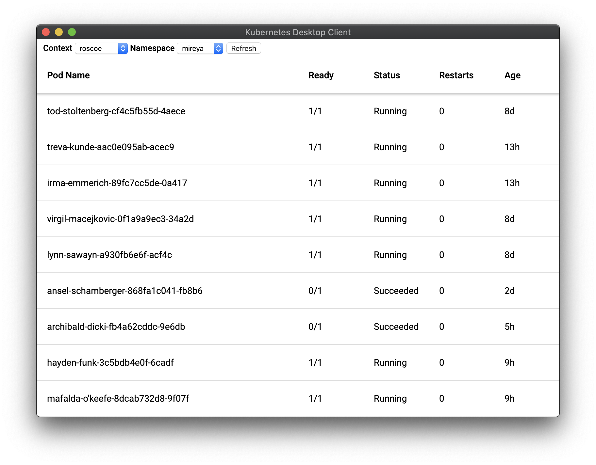
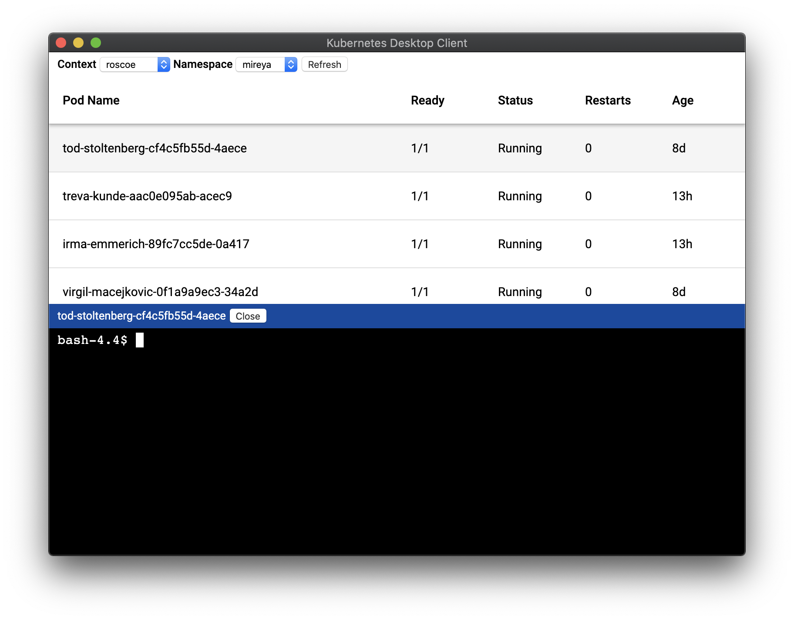
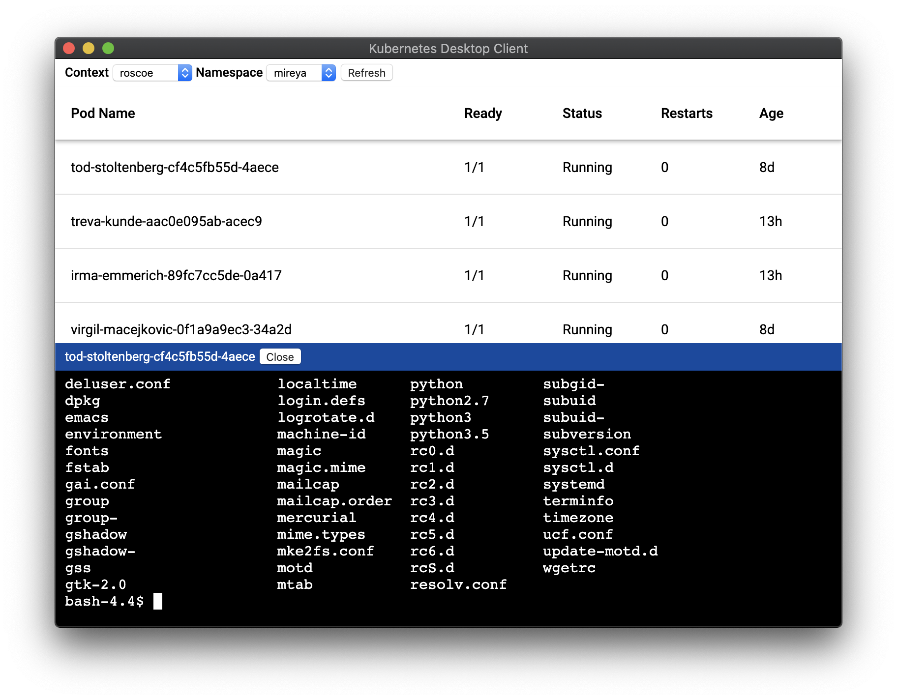
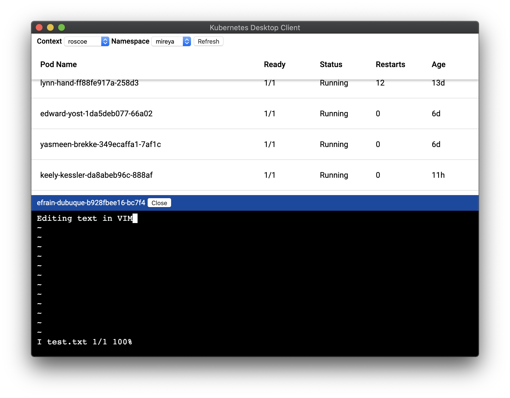

# Kubernetes Desktop Client

Kubernetes desktop client which allows to open terminal into a pod with a click of a button.

NOTE: This software is still work in progress

## Features

* Connect to running pod session, similar to what `kubectl exec -it pod-name` does
* Switch between different contexts and namespaces
* Search pod by labels
* View container logs

## Known Issues

* If token used by `kubectl` is expired, application will refresh it, but not save into `~/.kube/config`. This will cause `kubectl` break with error `Refresh token is invalid or has already been claimed by another client.`. The solution for now is to list some resources using `kubectl` in a corresponding context first, e.g.: `kubectl get pods`. After that everything will work fine, untill token expires again.

* List of pods is not updated automatically and requires manual update at the moment

* Opening terminal into a pod may not work in clusters which restrict to only using POST requests when connection to the terminal. This application uses WebSocket which requires to issue a GET request as part of it's handshake. `kubectl` doesn't use WebSocket, it uses SPDY.

## Troubleshooting

For easier troubleshooting run application from command line:

```bash
$ /Applications/Kubernetes\ Desktop\ Client.app/Contents/MacOS/Kubernetes\ Desktop\ Client
```

This way application logs will be pronted in console and it will help to figure out what the problem is.

## Downloads

All versions are available in [releases](https://github.com/inikolaev/get-kubernetes-desktop-client/releases).

## Screenshots





